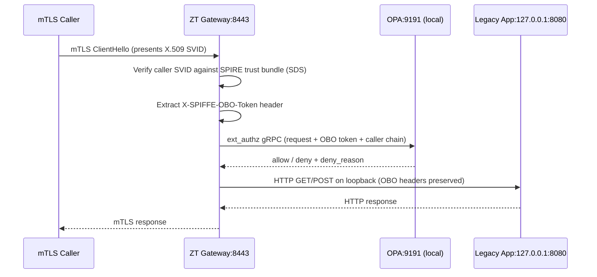
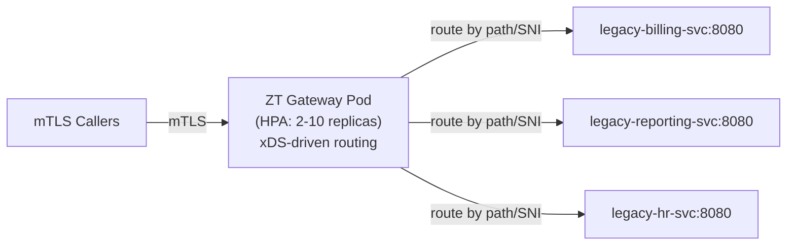

# Zero-Trust Onboarding Gateway

Legacy applications join the zero-trust fabric **without modifying their code**. A thin Envoy gateway container handles mTLS termination, SPIFFE SVID verification, OBO chain validation, and protocol translation. The legacy app sees a plain HTTP connection on loopback and has no awareness of zero-trust.

---

## Topology Decision Guide

| Question | → Topology A (Same-pod) | → Topology B (Dedicated pod) |
|---|---|---|
| How many legacy services? | 1–5 | 6+ |
| Traffic volume per service? | Low–medium | High (gateway scales independently) |
| Need per-service isolation? | Yes | No (gateway is shared) |
| Resource priority | App resources matter more | Gateway economics matter more |
| Dynamic routing (add services without restart)? | No | Yes (xDS-driven) |
| Observability granularity? | Per-pod | Aggregated across services |

---

## Topology A — Same-Pod Loopback Isolation

The legacy app container binds only to `127.0.0.1:8080`. The ZT gateway container on port `8443` is the only network-accessible entrypoint. They share a pod network namespace — the gateway's loopback is the app's loopback.



**Key pod design decision**: `sidecar.istio.io/inject: "false"` on the pod. The ZT gateway IS the proxy — adding an Istio sidecar would create two competing mTLS layers.

```yaml
# The only port exposed by the pod is the gateway port.
# The app port (8080) has no containerPort declaration — it's unreachable from outside.
containers:
  - name: zt-gateway
    ports:
      - containerPort: 8443  # ← only this is exposed
  - name: legacy-app
    # No ports declared — bound to 127.0.0.1 only
```

!!! example "Reference Implementation"
    | File | Purpose |
    |---|---|
    | [`gateway/topology-a-same-pod/pod-spec.yaml`](https://github.com/naren-chakraview/chakraview-zero-trust-blueprint/blob/main/gateway/topology-a-same-pod/pod-spec.yaml) | Two-container pod: zt-gateway + legacy-app; NetworkPolicy; Service |
    | [`gateway/topology-a-same-pod/envoy-config.yaml`](https://github.com/naren-chakraview/chakraview-zero-trust-blueprint/blob/main/gateway/topology-a-same-pod/envoy-config.yaml) | Static Envoy config: SPIRE SDS, ext_authz → OPA, OTEL tracing, loopback cluster |
    | [`gateway/topology-a-same-pod/ghostunnel-alternative/`](https://github.com/naren-chakraview/chakraview-zero-trust-blueprint/blob/main/gateway/topology-a-same-pod/ghostunnel-alternative/) | ghostunnel alternative: 15MB binary, native SPIFFE, no OPA ext_authz |

---

## Topology B — Dedicated Gateway Pod

One gateway Deployment (HPA-scaled, min 2 replicas) serves multiple legacy service pods in the `legacy` namespace. Backend services have no Service of their own — `NetworkPolicy` allows ingress only from the `zt-gateway` namespace.



The gateway uses Envoy's xDS API (pointing at Istiod) for dynamic route configuration. Adding a new upstream service requires:
1. Adding its `allowed_callers` entry in `identity/spiffe-ids.yaml`
2. Adding an xDS route entry pointing to the new service
3. Applying a `NetworkPolicy` that allows the gateway to reach the new pod

No gateway restart required.

!!! example "Reference Implementation"
    | File | Purpose |
    |---|---|
    | [`gateway/topology-b-dedicated-pod/gateway-deployment.yaml`](https://github.com/naren-chakraview/chakraview-zero-trust-blueprint/blob/main/gateway/topology-b-dedicated-pod/gateway-deployment.yaml) | Envoy Deployment + HPA + PDB + NetworkPolicy |
    | [`gateway/topology-b-dedicated-pod/envoy-bootstrap.yaml`](https://github.com/naren-chakraview/chakraview-zero-trust-blueprint/blob/main/gateway/topology-b-dedicated-pod/envoy-bootstrap.yaml) | xDS bootstrap pointing at Istiod; SPIRE SDS; OTEL tracing |

---

## Protocol Translation

The ZT gateway can bridge protocol gaps between legacy callers and modern upstreams (or vice versa). All translation happens in Envoy filter chains — no application code changes.

=== "HTTP/1.1 → gRPC"
    Caller sends HTTP/1.1; upstream speaks gRPC (HTTP/2).  
    Filter: `envoy.filters.http.grpc_http1_bridge`  
    Config: [`gateway/protocol-translation/http1-to-grpc.yaml`](https://github.com/naren-chakraview/chakraview-zero-trust-blueprint/blob/main/gateway/protocol-translation/http1-to-grpc.yaml)

=== "Plain TCP → mTLS"
    Legacy app sends raw TCP bytes; the cluster requires mTLS.  
    Filter: TCP proxy + `transport_socket: tls` (downstream mTLS termination)  
    OBO validation: per-connection (SPIFFE principal from TLS cert), not per-request  
    Config: [`gateway/protocol-translation/tcp-to-mtls.yaml`](https://github.com/naren-chakraview/chakraview-zero-trust-blueprint/blob/main/gateway/protocol-translation/tcp-to-mtls.yaml)

=== "REST/JSON → gRPC"
    Caller sends REST JSON; upstream speaks gRPC with protobuf.  
    Filter: `envoy.filters.http.grpc_json_transcoder` (requires `.proto` file descriptor)  
    Limitation: the legacy service's API must have a `.proto` definition.

=== "WebSocket"
    HTTP `Connection: Upgrade` is preserved through the gateway.  
    Filter: `envoy.filters.http.websocket`

---

## OBO Enforcement at the Gateway

The legacy app has zero awareness of OBO. The gateway is the enforcement point.

**Inbound** (calls arriving at the gateway): `ext_authz` → OPA `validate-obo-chain.rego` runs before the request reaches the legacy app. A caller without a valid OBO token (or not in the allow-list for a direct call) receives a `403` before the legacy app sees any traffic.

**Outbound** (legacy app calling a downstream service): the app makes a plain HTTP call. Two options to add OBO to its outbound calls:

1. **Wrapper library** — a thin HTTP client library injected at startup that reads the SPIFFE Workload API socket and attaches OBO headers. The app's code imports the library; no business logic changes.
2. **Outbound gateway** (Topology A only) — add a second Envoy listener in the same pod on a loopback port. The app makes calls to `127.0.0.1:8080/upstream`; the outbound Envoy listener constructs the OBO token and forwards with mTLS.

!!! example "Reference Implementation"
    | File | Purpose |
    |---|---|
    | [`gateway/obo-enforcement/ext-authz-config.yaml`](https://github.com/naren-chakraview/chakraview-zero-trust-blueprint/blob/main/gateway/obo-enforcement/ext-authz-config.yaml) | OPA DaemonSet + ext_authz gRPC server config |
    | [`gateway/obo-enforcement/obo-check.rego`](https://github.com/naren-chakraview/chakraview-zero-trust-blueprint/blob/main/gateway/obo-enforcement/obo-check.rego) | OBO validation policy (re-exports `chakra.authz` with gateway-specific decision fields) |
