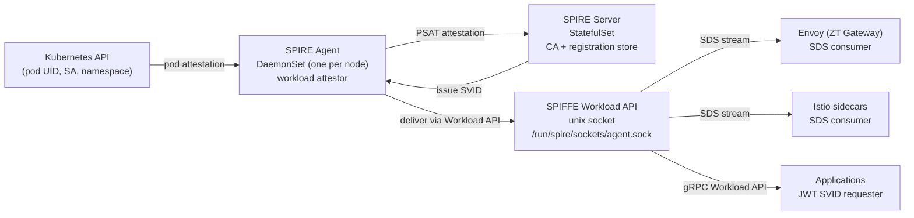

# Identity — SPIFFE/SPIRE

Every workload in the cluster gets a cryptographic identity. No static credentials. No service account strings. Every connection carries proof of what it is.

---

## Architecture



SPIRE integrates with Istio as the CA: Istio's `cacerts` secret is populated with the SPIRE-issued intermediate certificate. All Envoy sidecar certificates are SPIFFE SVIDs — Istio's mesh certificates _are_ SVIDs, not a parallel certificate system.

---

## SVID Types

**X.509 SVID** — Used for mTLS. The SPIFFE ID appears in the Subject Alternative Name of the TLS certificate. Renewed every hour without a pod restart; the SPIRE agent pushes the new cert to Envoy via SDS.

```
Subject: CN=orders-svc
SAN: URI:spiffe://chakra.internal/ns/orders/sa/orders-svc
Not After: <now + 1h>
```

**JWT SVID** — Used for OBO delegation. Short-lived (5 minutes), audience-scoped JWT signed by SPIRE. A service requests a JWT SVID for the downstream it intends to call:

```json
{
  "sub": "spiffe://chakra.internal/ns/orders/sa/orders-svc",
  "aud": ["spiffe://chakra.internal/ns/inventory/sa/inventory-svc"],
  "exp": 1714512900,
  "iat": 1714512600
}
```

The SPIRE agent caches JWT SVIDs — calls within the same 5-minute window reuse the cached token.

---

## SPIFFE ID Registry

[`identity/spiffe-ids.yaml`](https://github.com/naren-chakraview/chakraview-zero-trust-blueprint/blob/main/identity/spiffe-ids.yaml) — human-authored. Defines which workloads receive SVIDs and their OBO call chain constraints.

```yaml
- name: inventory-svc
  spiffe_id: spiffe://chakra.internal/ns/inventory/sa/inventory-svc
  namespace: inventory
  service_account: inventory-svc
  max_obo_chain_depth: 3
  allowed_callers:
    - spiffe://chakra.internal/ns/orders/sa/orders-svc
    - spiffe://chakra.internal/ns/api-gateway/sa/api-gateway
```

**`max_obo_chain_depth`**: prevents privilege escalation through deep delegation. A chain of A→B→C→D has depth 3; a chain of A→B→C→D→E would be depth 4 and is rejected by `validate-obo-chain.rego` if the limit is 3.

**`allowed_callers`**: OPA's `validate-obo-chain.rego` checks the JWT SVID subject against this list at every hop. An undeclared service-to-service call path is rejected, even if the mTLS connection is established.

---

## OBO Token Construction

```python
# Service making a downstream call on behalf of a user

import spiffe

workload_api = spiffe.WorkloadApiClient()

# Request a JWT SVID scoped to the downstream service
jwt_svid = workload_api.fetch_jwt_svid(
    audiences=["spiffe://chakra.internal/ns/inventory/sa/inventory-svc"]
)

headers = {
    "X-SPIFFE-OBO-Token": jwt_svid.token,
    "X-SPIFFE-Caller-Chain": f"{own_spiffe_id},{existing_chain}",
    "X-SPIFFE-User-Principal": user_principal,  # from the inbound request
}
```

The SPIRE agent signs the JWT with the cluster's CA key. The downstream service's Envoy sends it to OPA via ext_authz. OPA verifies the signature against the SPIRE trust bundle (loaded as an OPA bundle from the `spire-bundle` ConfigMap).

---

## Reference Implementation

| File | Purpose |
|---|---|
| [`identity/spire-server.yaml`](https://github.com/naren-chakraview/chakraview-zero-trust-blueprint/blob/main/identity/spire-server.yaml) | SPIRE Server StatefulSet: Kubernetes PSAT attestor, k8sbundle notifier, Prometheus metrics |
| [`identity/spire-agent.yaml`](https://github.com/naren-chakraview/chakraview-zero-trust-blueprint/blob/main/identity/spire-agent.yaml) | SPIRE Agent DaemonSet: workload attestor, SDS endpoint for Envoy |
| [`identity/spiffe-ids.yaml`](https://github.com/naren-chakraview/chakraview-zero-trust-blueprint/blob/main/identity/spiffe-ids.yaml) | SPIFFE ID registry: workloads, allowed callers, OBO chain depth limits |
| [`identity/obo-token-policy.rego`](https://github.com/naren-chakraview/chakraview-zero-trust-blueprint/blob/main/identity/obo-token-policy.rego) | OPA bundle policy: OBO chain validation logic (loaded by both Gatekeeper and standalone OPA) |
