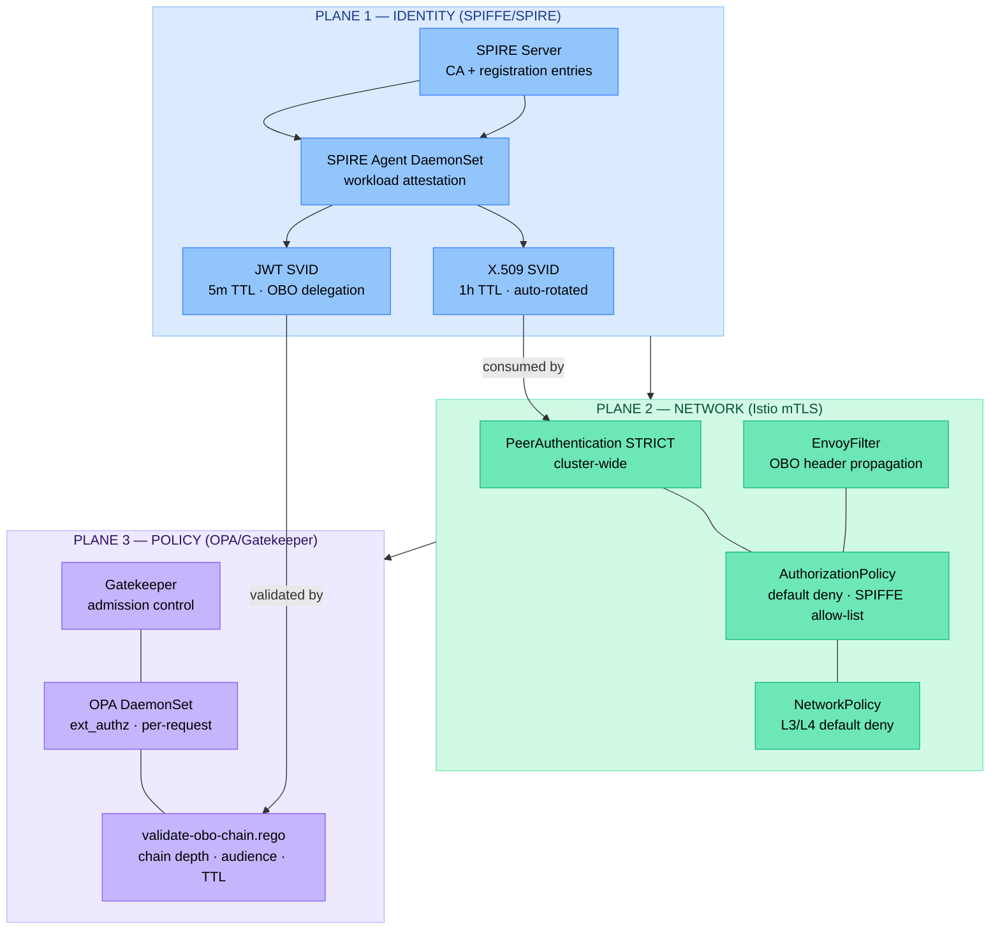
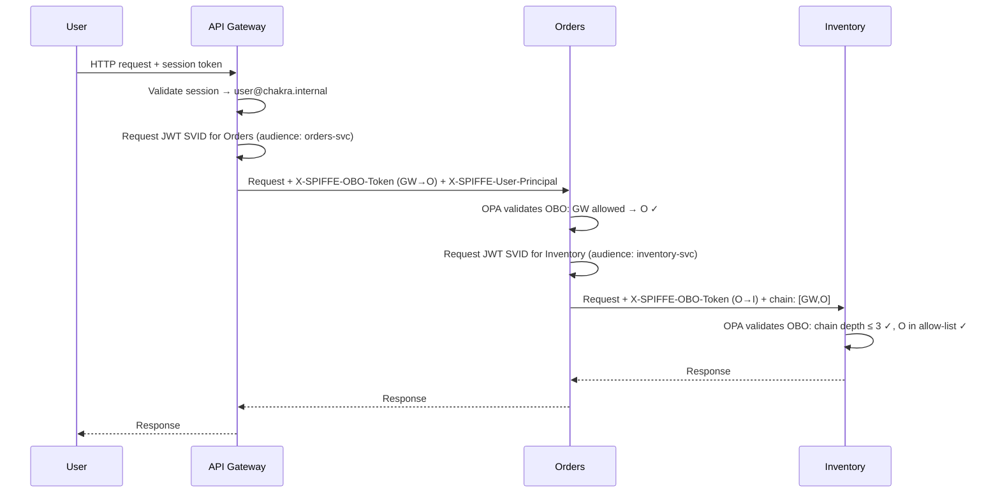
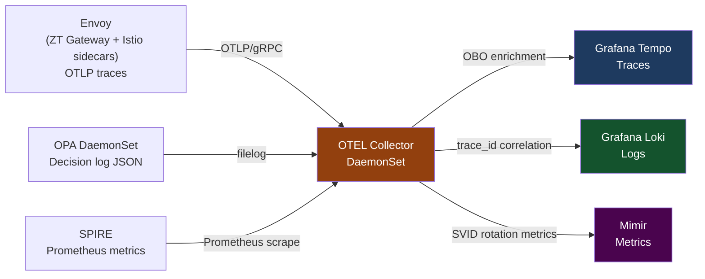

# Zero-Trust Blueprint

Three enforcement planes. One identity standard. Complete legacy application onboarding — without modifying the application.

---

## The Three-Plane Model



Each plane is independently replaceable. A failure in one plane does not bypass the others.

---

## ZT Onboarding Gateway

The centrepiece of this blueprint: bring legacy applications into the trust fabric **without modifying their code**.

=== "Topology A — Same-Pod"
    The legacy app binds only to `127.0.0.1`. The ZT gateway container is the sole network-accessible endpoint.

    ```
    [mTLS caller]
          │
          ▼
    [zt-gateway:8443]  ← SPIRE SDS SVID
          │             ← OPA ext_authz OBO check
          ▼
    [legacy-app:127.0.0.1:8080]
    ```

    **Best for**: Stateful legacy apps, per-instance isolation, smaller deployments.

=== "Topology B — Dedicated Gateway Pod"
    One gateway pod (HPA-scaled) serves multiple legacy service pods. Services expose no external port; `NetworkPolicy` restricts ingress to the gateway pod only.

    ```
    [mTLS callers]
          │
          ▼
    [zt-gateway-pod:8443]  ← xDS-driven routing
          ├──────────────▶ [svc-a-pod:8080]
          ├──────────────▶ [svc-b-pod:8080]
          └──────────────▶ [svc-c-pod:8080]
    ```

    **Best for**: Many legacy services, shared gateway economics, horizontal scale.

---

## On-Behalf-Of Token Chain

Every inter-service call preserves the identity of the originating principal through the full call chain. No service receives the user's session token; each service presents its own SPIFFE identity plus a delegated JWT SVID proving it was authorized by the upstream caller.



Every OPA decision in this chain is logged with `obo.chain` as a structured field, queryable in Loki and correlated with the Tempo trace by `trace_id`.

---

## OpenTelemetry Integration

Every security event produces a trace span. Every authz decision produces a log record. Both are correlated by `trace_id`.



The OBO enrichment processor in the OTEL Collector promotes OBO chain headers to first-class span attributes — `obo.caller_principal`, `obo.chain`, `obo.user_principal` — making every request's delegation chain searchable in Tempo without custom instrumentation.

---

## Repository Map

| Directory | What's there |
|---|---|
| [`identity/`](identity/index.md) | SPIRE server + agent manifests, SPIFFE ID registry, OBO policy |
| [`mesh/`](mesh/index.md) | Istio PeerAuthentication, AuthorizationPolicy, OBO EnvoyFilter |
| [`policy/`](policy/index.md) | OPA/Gatekeeper policies + Kyverno alternative |
| [`secrets/`](secrets/index.md) | Vault (primary) + AWS Secrets Manager (alternative) |
| [`gateway/`](gateway/index.md) | ZT gateway — both topologies, protocol translation, OBO enforcement |
| [`observability/`](observability/index.md) | SLOs, OTEL Collector, dashboards, alerts |
| [`docs/adrs/`](adrs/README.md) | 8 ADRs covering every major architectural decision |
